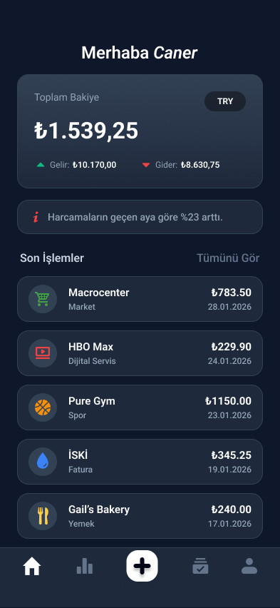
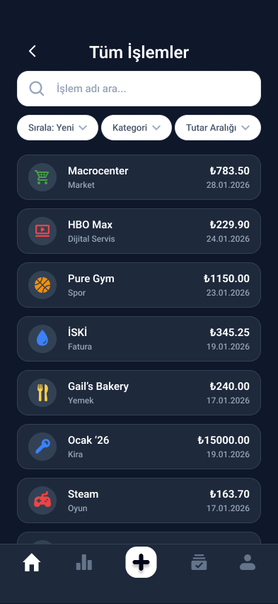
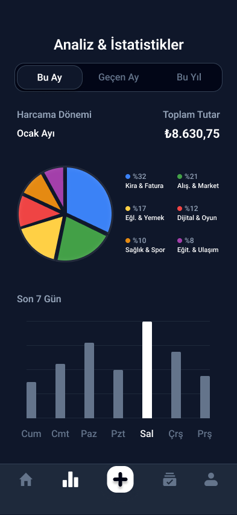
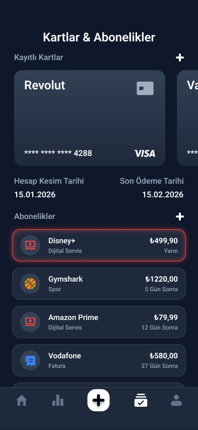
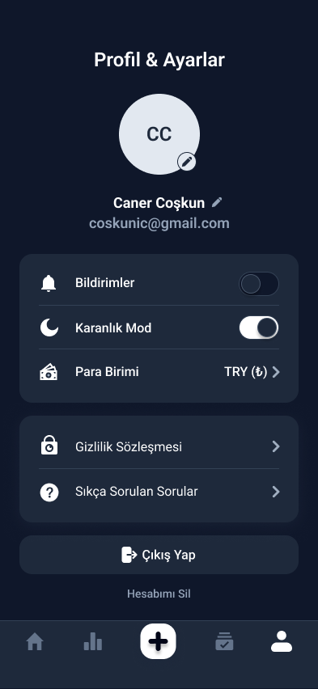
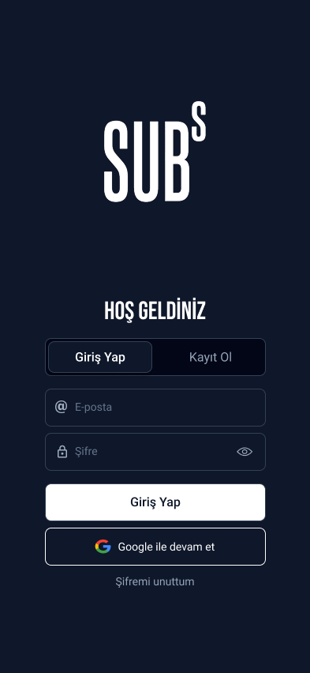

# 💰 SUBs — Kişisel Finans Takip Uygulaması

> Harcamalarını takip et, aboneliklerini yönet, finansal özgürlüğüne kavuş.

---

## 👨‍💻 Ekip

Bu proje, Siliconmade Academy MF107 Sınıfı Gunef ŞAHİN- Zeynep Ece GÖKÇE - İbrahim Caner COŞKUN öğrencileri tarafından Aşama Bitirme Projesi olarak geliştirilmiştir.

| İsim                 | LinkedIn                                                                                                                  |
| -------------------- | ------------------------------------------------------------------------------------------------------------------------- |
| Gunef ŞAHİN          | [linkedin.com/in/gunefshn](https://www.linkedin.com/in/gunefshn/)                                                         |
| Zeynep Ece GÖKÇE     | [linkedin.com/in/zeynep-ece-g%C3%B6k%C3%A7e-22b875208](https://www.linkedin.com/in/zeynep-ece-g%C3%B6k%C3%A7e-22b875208/) |
| İbrahim Caner COŞKUN | [linkedin.com/in/ibrahim-caner-coskun](https://www.linkedin.com/in/ibrahim-caner-coskun/)                                 |

---

SUBs, React Native ve Expo ile geliştirilmiş modern bir kişisel finans yönetimi uygulamasıdır. Kullanıcıların gelir/gider işlemlerini kaydetmesine, aboneliklerini ve kredi kartlarını yönetmesine, harcama analizlerini görselleştirmesine olanak tanır. Gerçek zamanlı döviz dönüşümü ve dark/light tema desteği ile kapsamlı bir deneyim sunar.

---

## 📱 Uygulama Ekran Görüntüleri

| Dashboard                                 | Tüm İşlemler                             | Analiz                              |
| ----------------------------------------- | ---------------------------------------- | ----------------------------------- |
|     |  |  |
| Bakiye, gelir/gider özeti ve son işlemler | Arama, filtreleme ve sıralama            | Pasta grafik ve haftalık bar chart  |

| Kartlar & Abonelikler                    | Profil & Ayarlar                    | Giriş                            |
| ---------------------------------------- | ----------------------------------- | -------------------------------- |
|  |    |    |
| Kart carousel ve abonelik listesi        | Tema, para birimi, şifre değiştirme | Email/şifre ile kimlik doğrulama |

---

## ✨ Özellikler

### 🏠 Dashboard

- Anlık toplam bakiye, gelir ve gider özeti
- Son 5 işlemi listeler
- Seçilen para birimine göre otomatik döviz dönüşümü
- Kullanıcıya özel karşılama mesajı

### 📋 Tüm İşlemler

- Tüm gelir/gider işlemlerini listeler
- İşlem adı ve kategoriye göre arama
- Yeni/Eski/Yüksek/Düşük sıralama seçenekleri
- Kategori bazlı filtreleme
- Tutar aralığı filtresi

### 📊 Analiz & İstatistikler

- Bu Ay / Geçen Ay / Bu Yıl dönem seçimi
- 6 gruplu pasta grafik (kategori bazlı dağılım):
  - Fatura & Kira
  - Alışveriş & Market
  - Eğlence & Yemek
  - Dijital & Oyun
  - Sağlık & Spor
  - Eğitim & Ulaşım
- Son 7 günlük harcama bar chart'ı
- En yüksek harcama günü vurgulama
- Para birimine göre toplam tutar

### 💳 Kartlar & Abonelikler

- Kredi kartı ekleme (kart adı, numara, kesim günü, marka)
- Yatay kaydırılabilir kart carousel
- Aktif kartın hesap kesim ve son ödeme tarihleri
- Abonelik ekleme (ad, tutar, kategori, yenileme günü)
- Yenileme tarihi yaklaşan abonelikler için uyarı (kırmızı border)
- "X Gün Sonra / Yarın / Bugün" yenileme göstergesi

### 👤 Profil & Ayarlar

- Ad soyad ve şifre değiştirme
- Dark / Light tema toggle (anlık geçiş)
- Bildirim tercihi
- Para birimi seçimi: TRY / USD / EUR
- Gerçek zamanlı döviz kuru (ExchangeRate-API)
- Hesap silme ve çıkış yapma

### 🔐 Kimlik Doğrulama

- Email ve şifre ile kayıt / giriş
- Oturum kalıcılığı (SecureStore)
- Otomatik yönlendirme
- Şifre doğrulamalı şifre değiştirme

---

## 🛠 Kullanılan Teknolojiler

### Frontend

| Teknoloji                  | Versiyon | Açıklama                      |
| -------------------------- | -------- | ----------------------------- |
| React Native               | 0.74+    | Mobil uygulama çatısı         |
| Expo                       | SDK 51+  | Geliştirme platformu          |
| Expo Router                | 3.x      | Dosya tabanlı navigasyon      |
| NativeWind                 | 4.x      | Tailwind CSS for React Native |
| React Native Reanimated    | 3.x      | Animasyonlar                  |
| React Native Gifted Charts | latest   | Pasta grafik                  |

### Backend & Veritabanı

| Teknoloji          | Açıklama                       |
| ------------------ | ------------------------------ |
| Supabase           | PostgreSQL veritabanı + Auth   |
| Row Level Security | Kullanıcı bazlı veri güvenliği |
| Supabase Auth      | Email/şifre kimlik doğrulama   |

### State & Storage

| Teknoloji         | Açıklama                |
| ----------------- | ----------------------- |
| React Context API | Global state yönetimi   |
| Expo SecureStore  | Oturum kalıcılığı       |
| AsyncStorage      | Tema ve tercih kaydetme |

### API & Servisler

| Servis           | Açıklama                     |
| ---------------- | ---------------------------- |
| ExchangeRate-API | Gerçek zamanlı döviz kurları |

---

## 🗄 Veritabanı Şeması

### `profiles`

```sql
id              uuid  (auth.users referansı)
email           text
full_name       text
currency_preference text default 'TRY'
```

### `transactions`

```sql
id          uuid
user_id     uuid
amount      numeric
category    text
date        timestamptz
note        text
type        text  -- 'income' | 'expense'
```

### `subscriptions`

```sql
id          uuid
user_id     uuid
name        text
cost        numeric
category    text
renewal_day integer
active      boolean
```

### `credit_cards`

```sql
id          uuid
user_id     uuid
card_name   text
card_number text
card_brand  text
cutoff_day  integer
due_day     integer
```

---

## 📁 Klasör Yapısı

```
├── app/
│   ├── (auth)/
│   │   ├── _layout.tsx          # Auth grup layout
│   │   └── login.tsx            # Giriş / Kayıt ekranı
│   ├── (tabs)/
│   │   ├── _layout.tsx          # Tab navigasyon layout
│   │   ├── dashboard.tsx        # Ana ekran
│   │   ├── analytics.tsx        # Analiz ekranı
│   │   ├── addTransactions.tsx  # İşlem ekleme
│   │   ├── subscriptions.tsx    # Kartlar & Abonelikler
│   │   └── profile.tsx          # Profil & Ayarlar
│   ├── components/
│   │   └── TransactionCard.tsx  # İşlem kartı komponenti
│   ├── screens/
│   │   ├── _layout.tsx          # Screens layout
│   │   └── allTransactions.tsx  # Tüm işlemler ekranı
│   ├── _layout.tsx              # Root layout
│   └── index.tsx                # Yönlendirme
│
├── src/
│   ├── contexts/
│   │   ├── AuthContext.tsx      # Kimlik doğrulama state
│   │   └── AppContext.tsx       # Tema, para birimi, döviz kurları
│   ├── hooks/
│   │   ├── useUser.ts           # Kullanıcı profili
│   │   ├── useTransactions.ts   # İşlem verileri
│   │   ├── useAnalytics.ts      # Analiz verileri + gruplama
│   │   └── useTheme.ts          # Dark/Light tema renkleri
│   ├── lib/
│   │   ├── supabase.ts          # Supabase istemcisi
│   │   └── exchange.ts          # Döviz API + dönüşüm
│   └── components/
│       └── AddFinanceModal.tsx  # Kart/Abonelik ekleme modal
│
├── global.css                   # NativeWind global stiller
├── tailwind.config.js           # Tailwind konfigürasyonu
├── app.json                     # Expo konfigürasyonu
└── package.json
```

---

## 🚀 Kurulum

### Gereksinimler

- Node.js 18+
- npm veya yarn
- Expo Go uygulaması (iOS / Android store'dan indir)

### 1. Repoyu klonla

GitHub üzerinden `main` branch'ini bilgisayarına indir:

```bash
git clone https://github.com/Gunefshn/Subs.git
cd subs
```

### 2. Bağımlılıkları yükle

```bash
npm install
```

### 3. Gerekli paketleri yükle

```bash
npm install @supabase/supabase-js @react-native-async-storage/async-storage @react-native-picker/picker expo-secure-store expo-blur nativewind react-native-gifted-charts react-native-safe-area-context @expo/vector-icons
```

### 4. Ortam değişkenlerini ayarla

`src/lib/supabase.ts` dosyasını düzenle:

```ts
const supabaseUrl = 'SUPABASE_URL';
const supabaseAnonKey = 'SUPABASE_ANON_KEY';
```

`src/lib/exchange.ts` dosyasını düzenle:

```ts
const EXCHANGE_API_KEY = 'EXCHANGERATE_API_KEY';
```

### 5. Supabase kurulumu

Supabase Dashboard → SQL Editor'da sırasıyla çalıştır:

```sql
-- Profil tablosu
create table public.profiles (
  id uuid references auth.users primary key,
  email text,
  full_name text,
  currency_preference text default 'TRY'
);

-- İşlemler tablosu
create table public.transactions (
  id uuid default gen_random_uuid() primary key,
  user_id uuid references auth.users,
  amount numeric,
  category text,
  date timestamptz,
  note text,
  type text
);

-- Abonelikler tablosu
create table public.subscriptions (
  id uuid default gen_random_uuid() primary key,
  user_id uuid references auth.users,
  name text,
  cost numeric,
  category text default 'Dijital Servis',
  renewal_day integer,
  active boolean default true
);

-- Kredi kartları tablosu
create table public.credit_cards (
  id uuid default gen_random_uuid() primary key,
  user_id uuid references auth.users,
  card_name text,
  card_number text,
  card_brand text default 'Mastercard',
  cutoff_day integer,
  due_day integer
);
```

RLS politikalarını ekle:

```sql
-- RLS aktif et
alter table public.profiles enable row level security;
alter table public.transactions enable row level security;
alter table public.subscriptions enable row level security;
alter table public.credit_cards enable row level security;

-- Politikalar (her tablo için select/insert/update/delete)
create policy "Kullanici kendi profilini yonetebilir"
  on public.profiles for all using (auth.uid() = id);

create policy "Kullanici kendi islemlerini yonetebilir"
  on public.transactions for all using (auth.uid() = user_id);

create policy "Kullanici kendi aboneliklerini yonetebilir"
  on public.subscriptions for all using (auth.uid() = user_id);

create policy "Kullanici kendi kartlarini yonetebilir"
  on public.credit_cards for all using (auth.uid() = user_id);
```

Otomatik profil oluşturma trigger'ı:

```sql
create or replace function public.handle_new_user()
returns trigger as $$
begin
  insert into public.profiles (id, email, full_name, currency_preference)
  values (new.id, new.email, new.raw_user_meta_data->>'full_name', 'TRY');
  return new;
end;
$$ language plpgsql security definer;

create trigger on_auth_user_created
  after insert on auth.users
  for each row execute procedure public.handle_new_user();
```

### 6. Uygulamayı başlat

```bash
npx expo start
```

Terminalde görünen QR kodu, telefonundaki **Expo Go** uygulaması ile okut. Uygulama otomatik olarak açılacaktır.

---

## 📖 Kullanım Kılavuzu

### 🔐 Giriş & Kayıt

- Uygulamayı açtığında giriş ekranıyla karşılaşırsın
- Kayıtlı kullanıcı isen e-posta ve şifreni girerek giriş yap
- Yeni kullanıcı isen **Kayıt Ol** butonuna basarak hesap oluştur
- Kayıt olduktan sonra otomatik olarak ana sayfaya yönlendirilirsin

### 🏠 Dashboard

- Ana sayfada toplam bakiye, gelir ve gider özetini görürsün
- Son işlemler listelenir
- Para birimi seçimine göre tutarlar otomatik güncellenir

### ➕ İşlem Ekleme

- Alt navigasyondaki **+** butonuna basarak yeni işlem ekleyebilirsin
- Gelir veya gider olarak işaretleyebilir, kategori ve not ekleyebilirsin

### 📊 Analiz

- Bu Ay / Geçen Ay / Bu Yıl dönemlerinde harcama dağılımını görürsün
- Kategori bazlı pasta grafik ve son 7 günlük bar chart mevcuttur

### 💳 Kartlar & Abonelikler

- Kredi kartı eklemek için **Kartlar** sekmesindeki **+** butonunu kullan
- Abonelik eklemek için **Abonelikler** sekmesindeki **+** butonunu kullan
- Yenileme tarihi yaklaşan abonelikler kırmızı kenarlıkla vurgulanır

### 👤 Profil & Ayarlar

- Profil ekranından adını ve şifreni güncelleyebilirsin
- Dark / Light tema, para birimi ve bildirim tercihlerini buradan ayarlarsın
- **Çıkış Yap** veya **Hesabımı Sil** işlemlerini bu ekrandan yapabilirsin

---

## 📦 Gerekli Paketler

```json
{
  "dependencies": {
    "@supabase/supabase-js": "^2.x",
    "@react-native-async-storage/async-storage": "^1.x",
    "@react-native-picker/picker": "^2.x",
    "expo-secure-store": "^13.x",
    "expo-blur": "^13.x",
    "nativewind": "^4.x",
    "react-native-gifted-charts": "^1.x",
    "react-native-safe-area-context": "^4.x",
    "@expo/vector-icons": "^14.x"
  }
}
```

---

## 🔑 API Anahtarları

| Servis           | Nereden Alınır                                       | Ücretsiz Plan        |
| ---------------- | ---------------------------------------------------- | -------------------- |
| Supabase         | [supabase.com](https://supabase.com)                 | 500MB DB, 50MB dosya |
| ExchangeRate-API | [exchangerate-api.com](https://exchangerate-api.com) | 1.500 istek/ay       |

---

## 🛡 Güvenlik

- Tüm tablolarda Row Level Security (RLS) aktif
- Kullanıcılar yalnızca kendi verilerine erişebilir
- Oturumlar Expo SecureStore ile şifreli saklanır
- Şifre değişikliği eski şifre doğrulaması gerektirir

---

## 📄 Lisans

MIT © 2026 SUBs Finance App — Siliconmade Academy MF107
